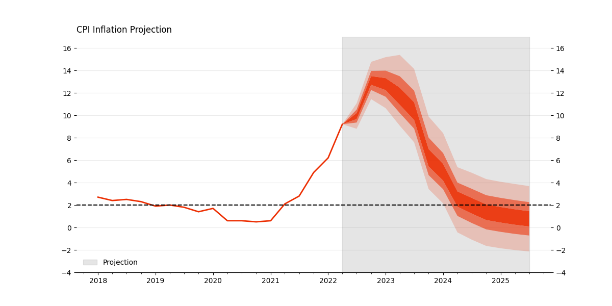
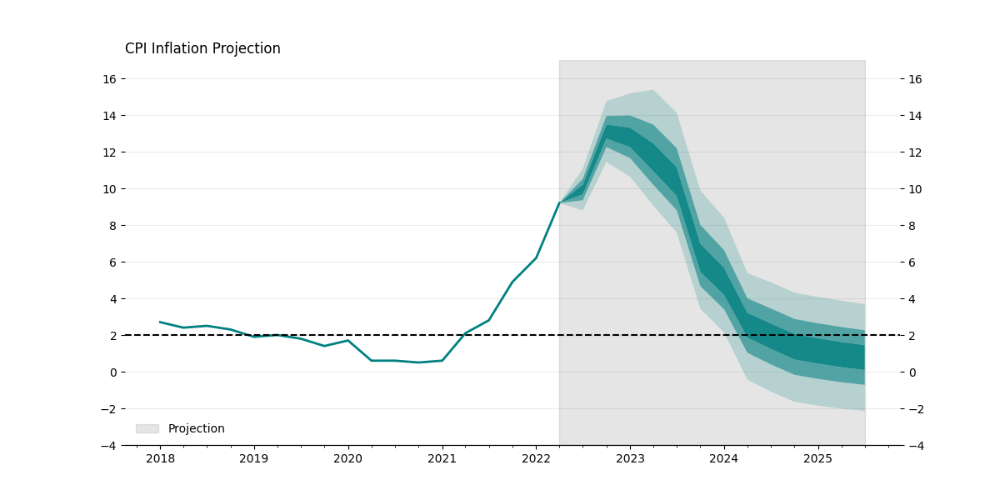
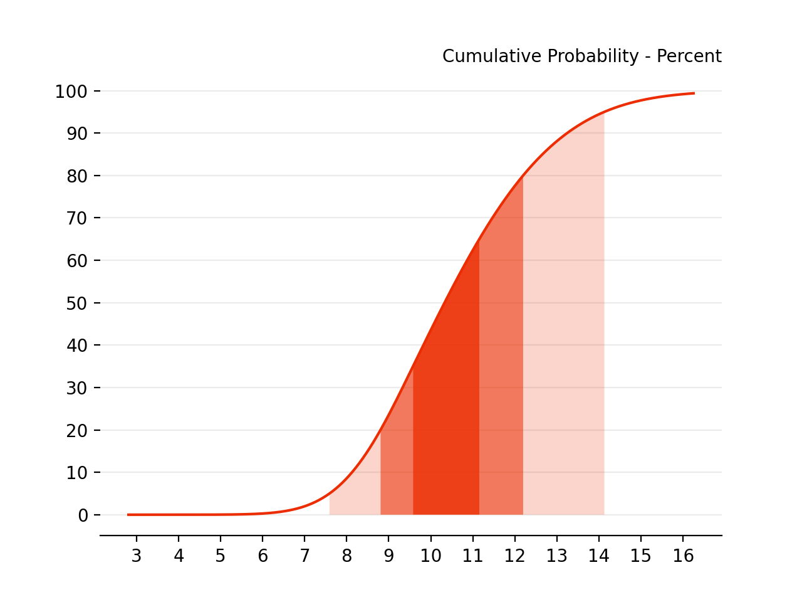

.. fanchart documentation master file, created by
   sphinx-quickstart on Thu Jan 19 22:07:25 2023.
   You can adapt this file completely to your liking, but it should at least
   contain the root `toctree` directive.

fanchart
========

|build| |rtd| |pypi| |downloads| |pyversions|

.. |build| image:: https://github.com/quantgirluk/fanchart/actions/workflows/python-package.yml/badge.svg
    :target: https://github.com/quantgirluk/fanchart/actions

.. |rtd| image:: https://img.shields.io/readthedocs/fanchart.svg
    :target: http://fanchart.readthedocs.io/en/latest/

.. |pypi| image:: https://img.shields.io/pypi/v/fanchart.svg
    :target: https://pypi.python.org/pypi/fanchart

.. |downloads| image:: https://static.pepy.tech/personalized-badge/fanchart?period=total&units=international_system&left_color=black&right_color=blue&left_text=Downloads
 :target: https://pepy.tech/project/fanchart

.. |pyversions| image:: https://img.shields.io/pypi/pyversions/fanchart.svg
    :target: https://pypi.python.org/pypi/fanchart

The fanchart library provides functionality to create fan charts in Python.

The term **fan chart** was coined by the `Bank of England <https://www.bankofengland.co.uk/>`_ in 1996. Since then, the  BoE
has used these charts to illustrate its forecasts for inflation.

The BoE introduced the fan charts aiming to communicate a more accurate representation of their forecast for medium term inflation. In particular, the charts have two key objectives:

- To convey the uncertainty in their forecasts. This is, to focus attention on  the forecast distribution, rather than only on small changes to the central projection.
- To promote discussion of the risks to the economic outlook, and thus contribute to a wider debate about economic policy. Fan charts help to make it clear that monetary policy is about making decisions instead of knowing the exact rate of inflation in two years time.

This library provides two main functions

- The `fan` function illustrates the distribution of all the forecasts available; and it has the option to display the historical values for reference.

- The `fan_single` function illustrates the probability density function (pdf) or the cumulative density function (cdf) of one forecast distribution

For more details on the history of fan charts visit `Fan Charts <https://quantgirl.blog/fan-charts/>`_

Installation
------------

Aleatory is available on `pypi <https://pypi.python.org/pypi>`_ and can be
installed as follows

.. code-block:: bash

   pip install fanchart

Dependencies
------------

Fanchart relies heavily on

- ``twopiece``  for the implementation of the Two-Piece normal distribution

- ``matplotlib`` for creating visualisations

Documentation
-------------

.. toctree::
   quick_start.rst

