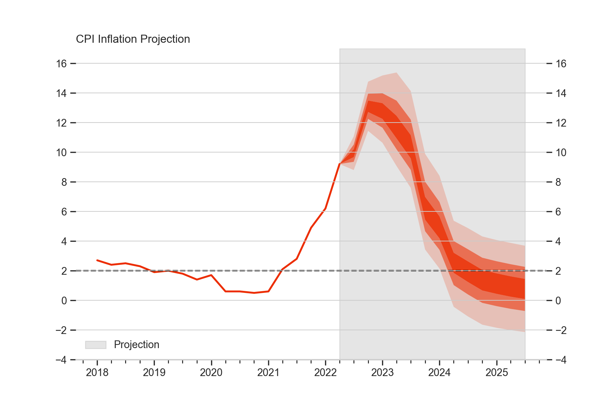
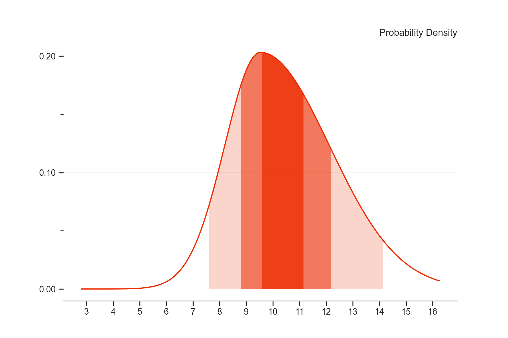

Quick-Start Guide
=================

This guide explains how to use the library `fanchart` to create charts as those included in the Monetary Policy Report produced by tge Bank of England (BoE).

Load Historical Data
--------------------

We start by loading the data required to make our first fan chart via the functions

- ``load_boe_history()`` which loads the historical data for inflation (CPI)
- ``load_boe_parameters()`` which loads the parameters for the quarterly projections

.. code-block:: python

    from fanchart import load_boe_history, load_boe_parameters

    history = load_boe_history()
    parameters = load_boe_parameters()

.. note::

 Both data sets correspond to the Monetary Policy Report - August 2022

Make your first Fan Chart
-------------------------

To make our first fan chart we use the ``fan`` function which requires the following three arguments:

- ``pars``    : A set of parameters to be used for the quarterly forecasts. Here we will the ``parameters`` loaded above.
- ``probs``   : A set probabilities that define the bands in the fan chart.

.. important::

  ``probs``  must be a sequence of increasing probabilities in an array type format.

- ``history`` : A set of historical values of the CPI inflation. Here we will use the ``history`` loaded above.

.. code-block:: python

    from fanchart import fan

    probs = [0.05, 0.20, 0.35, 0.65,0.80,  0.95]
    fan(pars=parameters, probs=probs, historic=history)

.. image:: _static/fan00.png

As we can see, this code produces a chart showing:

- The historical (observed) values of the CPI inflation from 2004 until a quarter before the projection starts.
- Then, the "fan" part is shown in a shadowed area and labeled as projection. This part illustrates the forecasted distribution for 13 quarters from the last observed value.

We can restrict the data in the history part to show only the data that we want.
For example, in the following fan chart we show only yearly data from 2018.

.. code-block:: python

    from fanchart import fan

    probs = [0.05, 0.20, 0.35, 0.65,0.80,  0.95]
    fan(pars=parameters, probs=probs, historic=history[history.Date >= '2018'])

Single Quarter Fan Charts
--------------------------

The fanchart package also provides functionality to visualise each of the quarterly forecast on its own.
This is achieved by the function ``fan_single`` which requires the following parameters:

- ``loc``   : Location parameter (Mode)
- ``sigma`` : Uncertainty parameter
- ``gamma`` : Skewness parameter
- ``probs``   : A set probabilities that define the bands in the fan chart.

.. important::

  ``probs``  must be a sequence of increasing probabilities in an array type format.

- ``kind``  : A string either 'pdf' or 'cdf' to define the type of plot

We can plot the forecasted probability density function as follows.

.. code-block:: python

    from fanchart import fan_single

    probs = [0.05, 0.20, 0.35, 0.65,0.80,  0.95]
    fan_single(loc=9.53, sigma=1.68, gamma=1.0, probs=probs, kind='pdf')

Similarly, we can plot the forecasted cumulative probability function.

.. code-block:: python

    from fanchart import fan_single

    probs = [0.05, 0.20, 0.35, 0.65,0.80,  0.95]
    fan_single(loc=9.53, sigma=1.68, gamma=1.0, probs=probs, kind='cdf')

.. image:: _static/fan05.png
